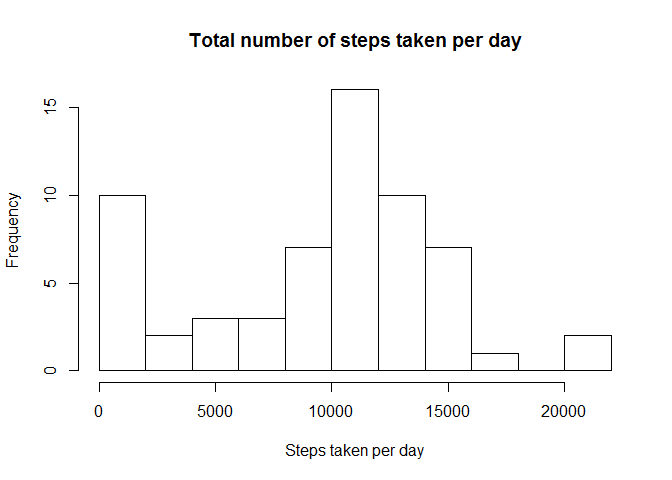
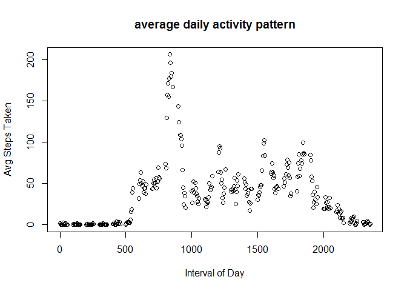
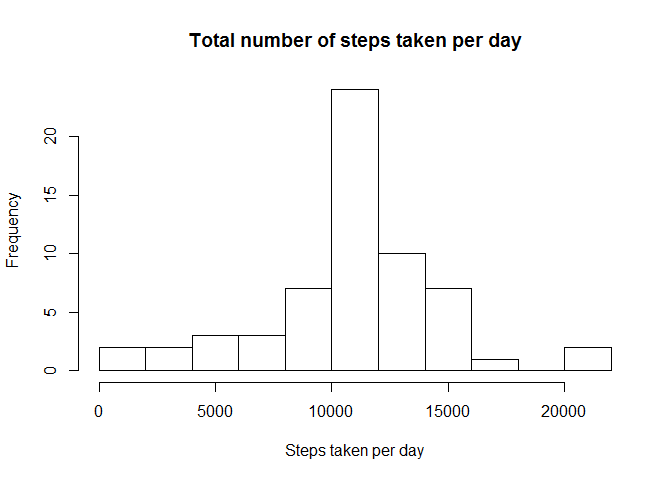
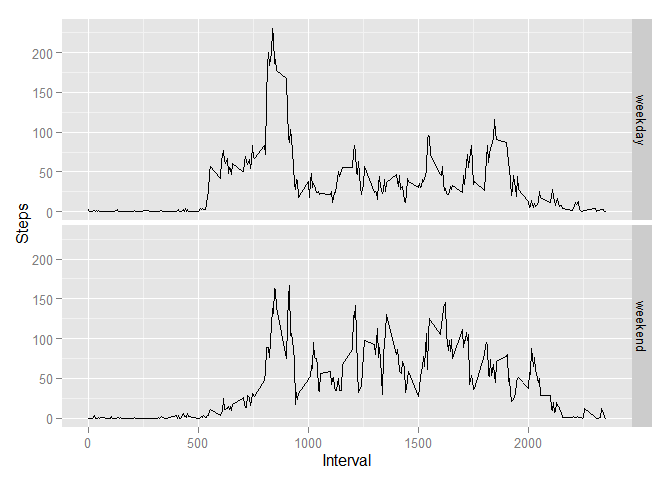

# Reproducible Research: Peer Assessment 1
## Loading and preprocessing the data

```r
if(!file.exists("./activity.csv")){
        unzip(zipfile = "./RepData_PeerAssessment1/activity.zip", exdir = "./") }

activity <- read.csv("./activity.csv")
#Calculate the total number of steps taken per day
totalStepsbyDay <- tapply(activity$steps, activity$date, FUN=sum, na.rm = TRUE)
#Calculate the total number of steps taken per interval
totalStepsbyInterval <- tapply(activity$steps, activity$interval, FUN = mean, na.rm=TRUE)
```


## What is mean total number of steps taken per day?

```r
#Calculate and report the mean of the total number of steps taken per day
mean(totalStepsbyDay, na.rm = TRUE)
```

```
## [1] 9354.23
```

```r
#Calculate and report the median of the total number of steps taken per day
median(totalStepsbyDay, na.rm = TRUE)
```

```
## [1] 10395
```

```r
#If you do not understand the difference between a histogram and a barplot, research the difference between them. Make a histogram of the total number of steps taken each day
hist(totalStepsbyDay, breaks = 10, main = "Total number of steps taken per day", xlab = "Steps taken per day")
```

 

## What is the average daily activity pattern?


```r
#Make a time series plot (i.e. type = "l") of the 5-minute interval (x-axis) and the average number of steps taken, averaged across all days (y-axis)
plot(names(totalStepsbyInterval), totalStepsbyInterval, main = "average daily activity pattern", xlab = "Interval of Day", ylab = "Avg Steps Taken")
```

 

```r
#Which 5-minute interval, on average across all the days in the dataset, contains the maximum number of steps?
names(which.max(totalStepsbyInterval))
```

```
## [1] "835"
```
## Imputing missing values

```r
#Calculate and report the total number of missing values in the dataset (i.e. the total number of rows with NAs)
sum(is.na(activity$steps))
```

```
## [1] 2304
```

```r
#Devise a strategy for filling in all of the missing values in the dataset. The strategy does not need to be sophisticated.
#Solution: Take the average of the before and after interval of five minutes

# replace missing value
replaceNA <- function(steps, interval) {
    buffer <- NA
    if (!is.na(steps))
        buffer <- c(steps)
    else
        buffer <- totalStepsbyInterval[names(totalStepsbyInterval) == interval]
    return(buffer)
}

regActivity <- activity
regActivity$steps <- mapply(replaceNA, regActivity$steps, regActivity$interval)
#histogram of the total number of steps taken each day 
regTotalStepsbyDay <- tapply(regActivity$steps, regActivity$date, FUN=sum)
hist(regTotalStepsbyDay, breaks = 10, main = "Total number of steps taken per day", xlab = "Steps taken per day")
```

 

```r
#calculate the new mean
mean(regTotalStepsbyDay)
```

```
## [1] 10766.19
```

```r
#calculate the new median
median(regTotalStepsbyDay)
```

```
## [1] 10766.19
```

## Are there differences in activity patterns between weekdays and weekends?
###Yes, people tend to get up and sleep later in weekend,

```r
determineDay <- function(actDate){
        day <- weekdays(as.Date(actDate))
        
        if (day %in% c("Monday", "Tuesday", "Wednesday", "Thursday", "Friday"))
        return("weekday")
    else if (day %in% c("Saturday", "Sunday"))
        return("weekend")
}

regActivity$day <- sapply(regActivity$date, FUN = determineDay)
#create dataset
compare <- aggregate(steps ~ interval + day, data = regActivity, mean)
#create plot
library(ggplot2)
ggplot(compare, aes(interval, steps)) + geom_line() + facet_grid(day ~ .) +  xlab("Interval") + ylab("Steps")
```

 
